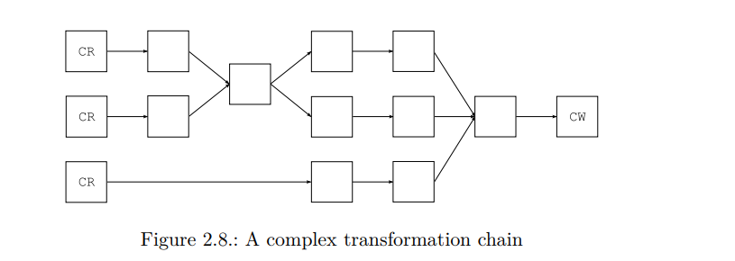

# Classes

[document](http://download.forge.objectweb.org/asm/asm4-guide.pdf)


## index

- <a href="#1">2.1.1 Overview</a>
- <a href="#2">2.1.2 Internal names</a>
- <a href="#3">2.1.3 Type descriptors</a>
- <a href="#4">2.1.4 Method descriptors</a>
- <a href="#5">2.2.1 Presentation</a>
- <a href="#6">2.2.2 Parsing classes</a>
- <a href="#7">2.2.3 Generating Classes</a>
- <a href="#8">2.2.4 Transforming classes</a>
- <a href="#9">2.2.5 Removing class members</a>
- <a href="#10">2.6.6 Adding class members</a>
- <a href="#11">2.2.7 Transforming chains</a>
- <a href="#12">2.3.1 Type</a>
- <a href="#13">2.3.2 TraceClassVisitor</a>
- <a href="#14">2.3.3 CheckClassAdapter</a>
- <a href="#15">2.3.4 ASMifier</a>


## structure

<div id="1"></div>

### 2.1.1 Overview


> Overall structure of a compiled class (*means zero or more)

<table>
  <tr>
    <td colspan="2">
      Modifiers, name, super class, interfaces
    </td>
  </tr>
  <tr>
    <td colspan="2">
      Constant pool: numeric, string and type constants
    </td>
  </tr>
  <tr>
    <td colspan="2">
      Source file name (optional)
    </td>
  </tr>
  <tr>
    <td colspan="2">
      Enclosing class reference
    </td>
  </tr>
  <tr>
    <td colspan="2">
      Annotation*
    </td>
  </tr>
  <tr>
    <td colspan="2">
      Attribute*
    </td>
  </tr>
  <tr>
    <td>Inner class*</td>
    <td>Name</td>
  </tr>
  <tr>
    <td>Field*</td>
    <td>      
        Modifiers, name, type <br />
        Annotation*<br />
        Attribute*<br />      
    </td>
  </tr>
  <tr>
    <td>Method*</td>
    <td>
      Modifiers, name, return and parameter types <br />
      Annotation*<br />
      Attribute*<br />
      compiled code<br />
    </td>
  </tr>
</table>

---

<div id="2"></div>

### 2.1.2 Internal names


SuperClass or interfaces implemented by a class .. etc  
=> 위와 같은 타입은 컴파일 된 클래스에서 Internal names로 나타남  
e.g)  
String == java/lang/String (. -> /)

---

<div id="3"></div>

### 2.1.3 Type descriptors

> Type descriptors of some Java types

<table width="100%">
  <tr>
    <th>Java type</th>
    <th>Type descriptor</th>
  </tr>
  <tr><td>boolean</td><td>Z</td></tr>
  <tr><td>char</td> <td>C</td></tr>
  <tr><td>byte</td> <td>B</td></tr>
  <tr><td>short</td> <td>S</td></tr>
  <tr><td>int</td> <td>I</td></tr>
  <tr><td>float</td> <td>F</td></tr>
  <tr><td>long</td> <td>J</td></tr>
  <tr><td>double</td> <td>D</td></tr>
  <tr><td>Object</td> <td>Ljava/lang/Object;</td></tr>
  <tr><td>int[]</td> <td>[I</td></tr>
  <tr><td>Object[][]</td> <td>[[L/java/lang/Object;</td></tr>  
</table>


---


<div id="4"></div>  

### 2.1.4 Method descriptors
; 파라미터 & 반환을 설명 == (parameters)return  


> Sample method descriptors

<table>
  <tr>
    <th>Method declaration in source file</th>
    <th>Method descriptor</th>
  </tr>
  <tr>
    <td>void m(int i, float f)</td>
    <td>(IF)V</td>
  </tr>
  <tr>
    <td>int m(Object o)</td>
    <td>(Ljava/lang/Object;)I</td>
  </tr>
  <tr>
    <td>int[] m(int i, String s)</td>
    <td>(ILjava/lang/String;)[I</td>
  </tr>
  <tr>
    <td>Object m(int[] i)</td>
    <td>([I)Ljava/lang/Object;</td>
  </tr>
</table>

---

## 2.2 Interfaces and components

<div id="5"></div>

### 2.2.1 Presentation
; ASM API를 통해 컴파일 된 클래스들을 변경 or 생성하는 것은 ClassVisitor에 기초를 두고 있음  


> ClassVisitor  

- 각각의 메소드는 클래스 파일 구조와 같은 이름 (위의 class file structure)
- visitAnnotation과 같이, auxiliary visitors(보조?)를 반환함
- ClassVisitor는 아래와 같은 순서대로 호출 되어야 함  
<pre>
visit visitSource? visitOuterClass? ( visitAnnotation | visitAttribute )*  
( visitInnerClass | visitField | visitMethod )*
visitEnd

== visit이 가장먼저 호출 & visitEnd가 마지막
</pre>

> ClassVisitor & FieldVisitor

<pre>
public abstract class ClassVisitor {
  public ClassVisitor(int api);

  public ClassVisitor(int api, ClassVisitor cv);

  public void visit(int version, int access, String name,
    String signature, String superName, String[] interfaces);

  public void visitSource(String source, String debug);

  public void visitOuterClass(String owner, String name, String desc);

  AnnotationVisitor visitAnnotation(String desc, boolean visible);

  public void visitAttribute(Attribute attr);

  public void visitInnerClass(String name, String outerName,
    String innerName, int access);

  public FieldVisitor visitField(int access, String name, String desc,
    String signature, Object value);

  public MethodVisitor visitMethod(int access, String name, String desc,
    String signature, String[] exceptions);

  void visitEnd();
}

public abstract class FieldVisitor {
  public FieldVisitor(int api);

  public FieldVisitor(int api, FieldVisitor fv);

  public AnnotationVisitor visitAnnotation(String desc, boolean visible);

  public void visitAttribute(Attribute attr);

  public void visitEnd();
}
</pre>


> ASM이 제공하는 핵심 컴포넌트

- **ClassReader** : 주어진 클래스파일(byte array)를 파싱 & ClassVisitor의  
visitXxx를 호출( ClassReader::acept()의 ClassVisitor 파라미터로 )
- **ClassWriter** : 컴파일된 클래스들을 binary form으로 빌드(subclass of ClassVisitor)  
ClassWriter::toByteArray()를 통해, byte array output 생성
- **ClassVisitor** : 다른 ClassVisitor로 모든 메소드 호출을 위임

---

<div id="6"></div>  

### 2.2.2 Parsing classes

**SampleCode**

> ClassPrinter

<pre>
import org.objectweb.asm.AnnotationVisitor;
import org.objectweb.asm.Attribute;
import org.objectweb.asm.ClassVisitor;
import org.objectweb.asm.FieldVisitor;
import org.objectweb.asm.MethodVisitor;
import org.objectweb.asm.Opcodes;

public class ClassPrinter extends ClassVisitor {
    public ClassPrinter() {
        super(Opcodes.ASM5);
    }

    public void visit(int version, int access, String name, String signature, String superName, String[] interfaces){
        System.out.println(name + " extends " + superName + " {");
    }

    public void visitSource(String source, String debug){

    }

    public void visitOuterClass(String owner, String name, String desc){

    }

    public AnnotationVisitor visitAnnotation(String desc, boolean visible){
        return null;
    }

    public void visitAttribute(Attribute attr){

    }

    public void visitInnerClass(String name, String outerName, String innerName, int access){

    }

    public FieldVisitor visitField(int access, String name, String desc, String signature, Object value){
        System.out.println(" " + desc + " " + name);
        return null;
    }

    public MethodVisitor visitMethod(int access, String name, String desc, String signature, String[] exceptions){
        System.out.println(" " + name + desc);
        return null;
    }

    public void visitEnd(){
        System.out.println("}");
    }
}
</pre>

> ClassPrinterRunner

<pre>
package com.asm_sample.document.ch2;

import java.io.IOException;

import org.objectweb.asm.ClassReader;

public class ClassPrinterRunner {
    public static void main(String[] args) throws IOException {
        ClassPrinter cp = new ClassPrinter();
        /* java/lang/Runnable을 파싱하는 ClassReader 생성 */
        ClassReader cr = new ClassReader("java.lang.Runnable");

        /* ClassLoader를 이용한 ClassReader 생성 */
        // ClassLoader cl = Thread.currentThread().getContextClassLoader();
        // ClassLoader cl = ClassPrinterRunner.class.getClassLoader();

        /* ClassPrinter 적용 */
        cr.accept(cp, 0);
    }
}
</pre>

> output

<pre>
java/lang/Runnable extends java/lang/Object {
 run()V
}
</pre>

---

<div id="7"></div>

### 2.2.3 Generating Classes
;클래스를 생성하는데 유일한 컴포넌트 == ClassWriter  


> 생성 할 인터페이스

<pre>
package pkg;
public interface Comparable extends Mesurable {
  int LESS = -1;
  int EQUAL = 0;
  int GREATER = 1;
  int compareTo(Object o);
}
</pre>

> javap

<pre>
public interface pkg.Comparable extends pkg.Mesurable {
  public static final int LESS;

  public static final int EQUAL;

  public static final int GREATER;

  public abstract int compareTo(java.lang.Object);
}
</pre>

> Generate

<pre>
ClassWriter cw = new ClassWriter(0);

// cw.visit(version, access, name, signature, superName, interfaces);
cw.visit(V1_5, ACC_PUBLIC + ACC_ABSTRACT + ACC_INTERFACE, "pkg/Comparable", null, "java/lang/Object", new String[]{"pkg/Mesurable"});

// cw.visitField(access, name, desc, signature, value)
// annotatoin이 없으므로, visitEnd() 호출
cw.visitField(ACC_PUBLIC + ACC_FINAL + ACC_STATIC, "LESS", "I", null, new Integer(-1)).visitEnd();
cw.visitField(ACC_PUBLIC + ACC_FINAL + ACC_STATIC, "EQUAL", "I", null, new Integer(0)).visitEnd();
cw.visitField(ACC_PUBLIC + ACC_FINAL + ACC_STATIC, "GREATER", "I", null, new Integer(1)).visitEnd();

// cw.visitMethod(access, name, desc, signature, exceptions)
cw.visitMethod(ACC_PUBLIC + ACC_ABSTRACT, "compareTo", "(Ljava/lang/Object;)I", null, null).visitEnd();
cw.visitEnd();
byte[] b = cw.toByteArray();
</pre>

> Runner

<pre>

</pre>

> cw.visit(version, access, name, signature, superName, interfaces);

- version(V1_5) : 자바 버전
- access(ACC_XXX) : Java modifiers에 대응하는 상수 플래그  
(2진수 논리곱 비트연산으로 체크 함)
- name : internal form  (컴파일 된 클래스는 패키지를  
import 하지 않으므로, 풀네임 필요)
- signature : generics(section4.1)
- superclass : internal form\
- interfaces : 구현 인터페이스들

> cw.visitField(access, name, desc, signature, value)  

- access : Java modifiers
- name : 필드 이름
- desc : 필드 타입 in type descriptor form
- signature : generics
- value : Constant value

> cw.visitMethod(access, name, desc, signature, exceptions)

- access : Java modifiers에 상응하는 flags
- name : 메소드 이름
- desc : descriptor of the method
- signature : generics
- exceptions : throws exceptions

=> MethodVisitor를 반환해서, annotations, attributes, methods code를 정의하는데 사용 할 수 있음  
=> visitEnd()를 통해, cw에게 종료됬다고 알림  


**Using generated classed**  

> Runner  

<pre>
public class GenerateClassRunner extends ClassLoader {    
    public static void main(String[] args) throws IllegalArgumentException, IllegalAccessException {
        byte[] bytes = GenerateClass.generateComparableInterface();
        Class<?> comparableClazz = new GenerateClassRunner().defineClass("com.asm_sample.document.ch2.Comparable", bytes);
        Field[] fields = comparableClazz.getFields();

        for(Field field : fields) {
            CustomLogger.println("## [field] :: name : {} , value : {}", new Object[]{field.getName(), field.get(null)});
        }

        Method[] methods = comparableClazz.getDeclaredMethods();
        for(Method method : methods) {
            CustomLogger.println("## [method] :: name : {}",new Object[]{method.getName()});
        }
    }    
    public Class defineClass(String name, byte[] b) {
        return defineClass(name, b, 0, b.length);
    }    
}
</pre>

> Result


```\#\# [field] :: name : LESS , value : -1
## [field] :: name : EQUAL , value : 0
## [field] :: name : GREATER , value : 1
## [method] name : compareTo
```


---

<div id="8"></div>

### 2.2.4 Transforming classes

> class reader로부터 파싱 된 클래스를 class writer가 reconstruct

<pre>
  byte[] b1 = ...;
  ClassWriter cw = new ClassWriter(0);
  ClassReader cr = new ClassReader(b1);
  cr.accept(cw,0);
  // b2 represents the same class as b1
  byte[] b2 = cw.toByteArray();  
</pre>  


> ClassVisitor between ClassReader & ClassWriter  

<pre>
  byte[] b1 = ...;
  ClassWriter cw = new ClassWriter(0);
  // cv forwards all events to cw
  ClassVisitor cv = new ClassVisitor(ASM4, cw){};
  ClassReader cr = new ClassReader(b1);
  cr.accept(cv,0);
  // b2 represents the same class as b1
  byte[] b2 = cw.toByteArray();  
</pre>

> A transformation chain


- 사각형 : components
- 화살표 : events


> ChangeVersionAdapter

<pre>
public class ChangeVersionAdapter extends ClassVisitor implements Opcodes {
    public ChangeVersionAdapter(ClassVisitor cv) {
        super(ASM5, cv);
    }    
    @Override
    public void visit(int version, int access, String name, String signature, String superName, String[] interfaces) {
        cv.visit(V1_5, access, name, signature, superName, interfaces);        
    }
}
</pre>

> Sequence diagram for the ChangeVersionAdapter


- visit 메소드의 다른 args를 변경해서 원하는 클래스 변경이 가능!

**Optimization**  

--> 위의 코드는 원래 클래스보다 버전만 바꿈(4bytes)  
--> BUT b1, b2 둘다 바이트 코드 생성
--> 비효율적임  
--> 바뀌지 않는 부분은 b1을 복사하는게 효율적  
--> ASM은 자동적으로 아래와 같은 최적화를 이행
- If a ClassReader component detects that a MethodVisitor returned by  
the ClassVisitor passed as argument to its accept method comes from  
a ClassWriter, ??  
- i.e ClassReader 컴포넌트는 메소드의 content는 transform 되지 않고, events에 상응하는 것을  
생성하지도 않고 단순히 ClassWriter 안의 위 메소드의 바이트 배열을 복사)

> 서로 참조하면 위와같은 최적화가 진행

<pre>
byte[] b1 = ...
ClassReader cr = new ClassReader(b1);
ClassWriter cw = new ClassWriter(cr,0);
ChangeVersionAdapter ca = new ChangeVersionAdapter(cw);
cr.accept(ca, 0);
byte[] b2 = cw.toByteArray();
</pre>

- 위와같은 최적화로 두배 이상빠름(ChangeVersionAdapter는 어떤 메소드도 변경하지 않으므로)
- 일부 or 모든 메소드를 변경하는 경우에도 약 20% 성능 향상이 있음


> Optimize test (_테스트 다시 해보기_)

<pre>
// first transform
byte[] b1 = GenerateClass.generateComparableInterface();
long time = -System.currentTimeMillis();
ClassWriter cw = new ClassWriter(0);
// cv forwards all events to cw
ClassVisitor cv = new ChangeVersionAdapter(cw);
ClassReader cr = new ClassReader(b1);
cr.accept(cv, 0);
byte[] b2 = cw.toByteArray();
time += System.currentTimeMillis();
// 6ms or 4836815ns
CustomLogger.println("## [first transform] :: {} ms", time);

// optimized transform
byte[] b3 = GenerateClass.generateComparableInterface();
time = -System.currentTimeMillis();
ClassReader cr2 = new ClassReader(b3);
ClassWriter cw2 = new ClassWriter(cr,0);
ChangeVersionAdapter ca = new ChangeVersionAdapter(cw2);
cr2.accept(ca, 0);
byte[] b4 = cw.toByteArray();
time += System.currentTimeMillis();
// 0ms or 98549ns
CustomLogger.println("## [optimized transform] :: {} ms", time);
</pre>


**Using transformed classes**  
-> ClassLoader에 있는 변경 된 클래스는 오직 이 클래스 로더에 의해  
로드되는 클래스들을 변경할 수 있다.  
-> java.lang.instrument.ClassFileTransformer를 이용해 모든 클래스 변경


> 모든 클래스 변경하기

<pre>
public static void premain(String agentArgs, Instrumentation inst) {
  inst.addTransformer(new ClassFileTransformer() {
      public byte[] transform(ClassLoader l, String name, Class c, ProtectionDomain d,
                          byte[] b) throws IllegalClassFormatException {
        ClassReader cr = new ClassReader(b);
        ClassWriter cw = new ClassWriter(cr, 0);
        ClassVisitor cv = new ChangeVersionAdapter(cw);
        cr.accept(cv, 0);
        return cw.toByteArray();
      }
  });
}
</pre>

> java api 확인하기  

- [java.lang.instrument api(java6)](https://docs.oracle.com/javase/6/docs/api/java/lang/instrument/package-summary.html)  
- [java.lang.instrument api(java7)](https://docs.oracle.com/javase/7/docs/api/java/lang/instrument/package-summary.html)  
- [java.lang.instrument api(java8)](https://docs.oracle.com/javase/8/docs/api/java/lang/instrument/package-summary.html)  

---

<div id="9"></div>

### 2.2.5 Removing class members

-> 위의 ChangeVersionAdapter의 메소드는 ClassVisitor 클래스의 다른 메소드에 적용 가능  

> e.g)

<pre>
visitField --> field의 name, modifiers를 변경함으로써 access or name을 변경 가능
visitMethod --> method의 name, modifiers를 변경함으로써 access or name을 변경 가능
</pre>

-> 체인에서 변경이 이루어지는 다음 호출을 막을 수도 있음  
i.e class의 요소를 삭제

> removes outer & inner class , name of source file

<pre>
public class RemoveDebugAdapter extends ClassVisitor implements Opcodes {
    public RemoveDebugAdapter(ClassVisitor cv) {
        super(ASM5, cv);
    }

    @Override
    public void visitSource(String source, String debug) {        
    }

    @Override
    public void visitOuterClass(String owner, String name, String desc) {        
    }

    @Override
    public void visitInnerClass(String name, String outerName, String innerName, int access) {        
    }
}
</pre>

-> 위의 Adapter는 메소드나 필드에는 적용X(result를 리턴해야 하므로)  
-> 메소드나 필드를 삭제하기 위해서는, 이어지는 method 호출을 막고 caller에게 null 반환

> e.g) RemoveMethod

<pre>
public class RemoveMethodAdapter extends ClassVisitor implements Opcodes {
    private String mName;
    private String mDesc;  

    public RemoveMethodAdapter(ClassVisitor cv, String mName, String mDesc) {
        super(ASM5, cv);
        this.mName = mName;
        this.mDesc = mDesc;
    }

    @Override
    public MethodVisitor visitMethod(int access, String name, String desc, String signature, String[] exceptions) {
        if(name.equals(mName) && desc.equals(mDesc)) {
            // do not delete to next visitor
            return null;
        }

        return cv.visitMethod(access, name, desc, signature, exceptions);
    }
}
</pre>

---

<div id="10"></div>

### 2.6.6 Adding class members
; visitXxx를 통해 동적으로 멤버 삽입 가능  
(visit, visitSource, visitOuterClass, visitAnnotation, visitAttribute 에는 넣지 못함  
this may result in a call to visitField followed by visitSource, visitOuterClass,   
visitAnnotation or visitAttribute, which is not valid.)  

**Note** : 새로운 멤버들을 삽입하는 것은 visitEnd 메소드를 이용하는 것  
(이름 중복 등등)


> Generate Member Field

<pre>
public class AddFieldAdatper extends ClassVisitor implements Opcodes {
    private int fAcc;
    private String fName;
    private String fDesc;
    private boolean isFieldPresent;

    public AddFieldAdatper(ClassVisitor cv, int fAcc, String fName, String fDesc) {
        super(ASM5, cv);
        this.fAcc = fAcc;
        this.fName = fName;
        this.fDesc = fDesc;
    }

    @Override
    public FieldVisitor visitField(int access, String name, String desc, String signature, Object value) {
        // check duplicate field name
        if(name.equals(fName)) {
            isFieldPresent = true;
        }

        return cv.visitField(access, name, desc, signature, value);
    }

    @Override
    public void visitEnd() {
        if(!isFieldPresent) {
            FieldVisitor fv = cv.visitField(fAcc, fName, fDesc, null, null);
            if(fv != null) {
                fv.visitEnd();
            }
        }
        cv.visitEnd();
    }
}
</pre>

> Add field runner

<pre>
public class AddFieldRunner extends ClassLoader {    
    public static void main(String[] args) throws IOException {
        // add field member
        String className = "com.asm_sample.document.ch2.domain.TestClass";

        ClassLoader loader = AddFieldAdatper.class.getClassLoader();
        ClassReader cr = new ClassReader(loader.getResourceAsStream(className.replace('.', '/') + ".class"));
        ClassWriter cw = new ClassWriter(cr, 0);
        AddFieldAdatper addFieldAdapter = new AddFieldAdatper(cw, Opcodes.ACC_PRIVATE, "addedField","Ljava/lang/String;");
        cr.accept(addFieldAdapter, 0);
        byte[] bytes = cw.toByteArray();

        //  check
        Class<?> clazz = new AddFieldRunner().defineClass(className, bytes, 0, bytes.length);
        Field[] fields = clazz.getDeclaredFields();
        for(Field field : fields) {
            CustomLogger.println("## name : {} , type : {}", field.getName() , field.getType());
        }
    }
}
</pre>


> result

<pre>
visitField() :: access :2, name : age , desc : I , signature : null, value : null
visitField() :: access :2, name : name , desc : Ljava/lang/String; , signature : null, value : null
name : age , type : int
name : name , type : class java.lang.String
name : addedField , type : class java.lang.String
</pre>

=> visitField를 이용하지 않음(원래 멤버필드를 변경하거나 삭제하지 않기 위해)  
=> visitField에서 null을 반환할 수도있으므로, if(fv!=null) check


<div id="11"></div>

### 2.2.7 Transforming chains

> ??? document 2.2.7 보기

<pre>
public class MultiClassAdapter extends ClassVisitor {
    protected ClassVisitor[] cvs;
    public MultiClassAdapter(ClassVisitor[] cvs) {
        super(Opcodes.ASM5);
        this.cvs = cvs;
    }

    @Override
    public void visit(int version, int access, String name, String signature, String superName, String[] interfaces) {
        for(ClassVisitor cv : cvs) {
            cv.visit(version, access, name, signature, superName, interfaces);
        }
    }
}
</pre>

---

## 2.3 Tools
; org.objectweb.asm.util 패키지에서 몇가지 툴을 제공함



<div id="12"><div>

### 2.3.1 Type
; internal name or type descriptor를 확인해서 더욱 안정성 높임

> Type example

<pre>
import org.objectweb.asm.Type;

import com.asm_sample.util.CustomLogger;

public class TypeCheck {
    public static void main(String[] args) {        
        CustomLogger.println("Type.INT_TYPE : {}, Type.getType(String.class) : {}, Type.getType(String.class).getInternalName() : {} "
                ,new Object[]{Type.INT_TYPE, Type.getType(String.class), Type.getType(String.class).getInternalName()});

        CustomLogger.println("Type.getType(String.class).getDescriptor() : {}"
                , new Object[]{Type.getType(String.class).getDescriptor()});
    }
}

Type.INT_TYPE : I, Type.getType(String.class) : Ljava/lang/String;, Type.getType(String.class).getInternalName() : java/lang/String
Type.getType(String.class).getDescriptor() : Ljava/lang/String;
</pre>

---

<div id="13"><div>

### 2.3.2 TraceClassVisitor
; ClassWriter는 byte를 반환하므로 사람이 해석X => TraceClassVisitor를 이용

> TraceClassVisitor example

<pre>
import org.objectweb.asm.util.TraceClassVisitor;

public class TraceClassVisitorRunner {
    public static void main(String[] args) throws IOException {
        ClassWriter cw = new ClassWriter(0);
        TraceClassVisitor cv = new TraceClassVisitor(cw, new PrintWriter(System.out));
        ClassReader cr = new ClassReader("java.lang.Runnable");
        cr.accept(cv, 0);
    }
}
</pre>

> result

<pre>
// class version 52.0 (52)
// access flags 0x601
public abstract interface java/lang/Runnable {


  @Ljava/lang/FunctionalInterface;()

  // access flags 0x401
  public abstract run()V
}
</pre>

---

<div id="14"></div>

### 2.3.3 CheckClassAdapter

=> ClassWrite는 오류를 체크하지 않음  
=> 오류가 존재하는 코드 생성 가능  
=> 자바 가상 머신 verifier에서 오류 발생 할 수 있음  

=> TraceClassVisitor와 같이 모든 메소드 호출을 위임하지만,  
다음 visitor를 호출하기 전에 메소드가 적절한 순서로 호출 되었는지,  
유효한 args인지, 등등 체크
(IllegalStateException or IllegalArgumentException 던짐)

> CheckClassAdapter example

<pre>
ClassWriter cw = new ClassWriter(0);
TraceClassVisitor tcv = new TraceClassVisitor(cw, printWriter);
CheckClassAdapter cv = new CheckClassAdapter(tcv);
cv.visit(...);
...
cv.visitEnd();
byte b[] = cw.toByteArray();
</pre>

---

<div id="15"></div>

### 2.3.4 ASMifier
;P35 다시 하기
