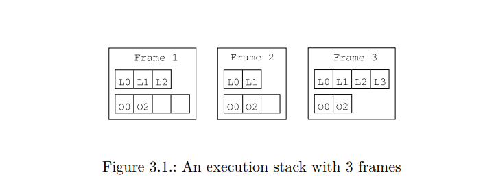
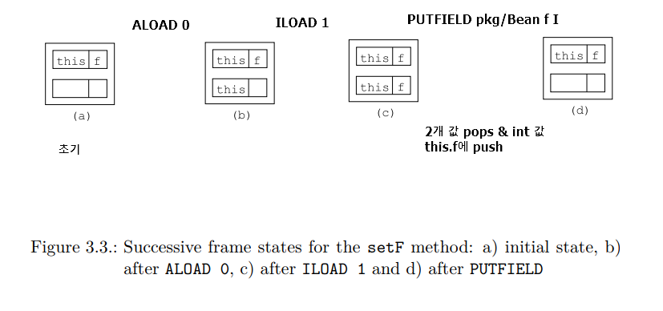

# 3. Methods

[document](http://download.forge.objectweb.org/asm/asm4-guide.pdf)

## index

- <a href="#3.1.1">3.1.1 Execution model</a>
- <a href="#3.1.2">3.1.2 Bytecode instructions</a>

## 3.1 Structure
컴파일 된 클래스의 메소드 관련 코드는 일련의 bytecode instructions로 이루어짐  
( 선수지식 :: Java Virtual Machine Specification )  

### 3.1.1 Execution model

- thread는 각각 자신의 (frames로 이루어진) execution stack 을 가지고 있음  
  - local variables part : 임의 순서 & index로 접근
  - operand stack part : stack (Last In First Out)

- 각각의 slot은 자바의 값을 담음(double , long 은 2슬롯)  
=> i번째 슬롯은 i번째 지역변수가 아님

### 3.1.2 Bytecode instructions
A bytecode instruction 는 instruction을 식별하는 opcode &  
arguments의 고정 된 숫자로 이루어짐

** 위 설정 정리 하기 **

### 3.1.3. Examples

> Sample Bean Class

<pre>
package pkg;
public class Bean {
    private int f;

    public int getF() {
        return f;
    }

    public void setF(int f) {
        this.f = f;
    }
}
</pre>

>  Getter Method

<pre>
ALAOD 0 // 이 메소드의 frame을 만드는 동안 0번쨰 지역변수 초기화(this) && 값을 operancd stack에 push
GETFIELD pkg/Bean f I // stack으로 부터 value를 pop (this) & push f field of this object
IRETURN // pops this value from stack & returns it to caller
</pre>

> Setter Method

<pre>
ALOAD 0 // 이 메소드의 frame을 만드는 동안 0번쨰 지역변수 초기화(this) && 값을 operancd stack에 push
ILOAD 1 // local variable 1을 push (메소드 호출의 frame을 생성하는 동안)
PUTFIELD pkg/Bean f I // 2개의 값을 pop & int 값을 this.f에 push
RETURN // 현재 실행 frame destroy && caller에게 return
</pre>

> Constructor  

<pre>
INVOKESPECIAL java/lang/Object <init> ()V // operand stack에 this push
RETURN // pop this value && call the <init> method (super class에 정의 된, 여기서는 Object)
==> 생성자 == { 소스코드 : "Class Name" , 컴파일 된 코드 : "<init>" }
</pre>

> Other Method  

<pre>
public void checkAndSetF(int f) {
  if (f >= 0) {
    this.f = f;
  } else {
    throw new IllegalArgumentException();
  }
}
</pre>

> bytecode  

<pre>
ILOAD 1 // push 지역변수 1(초기화 된 f) on the operand stack
IFLT label //
ALOAD 0
ILOAD 1
PUTFIELD pkg/Bean f I
GOTO end
label:
NEW java/lang/IllegalArgumentException
DUP
INVOKESPECIAL java/lang/IllegalArgumentException <init> ()V
ATHROW
end:
RETURN
</pre>

----------------------
