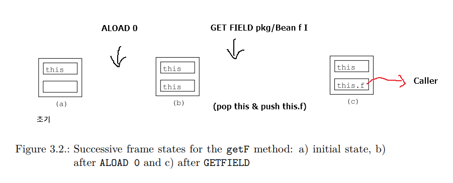

# 3. Methods

[document](http://download.forge.objectweb.org/asm/asm4-guide.pdf)

## index

- <a href="#3.1.1">3.1.1 Execution model</a>
- <a href="#3.1.2">3.1.2 Bytecode instructions</a>
- <a href="#3.1.3">3.1.3 </a>
- <a href="#3.1.4">3.1.4 Exception Handlers</a>
- <a href="#3.1.5">3.1.5 Frames</a>
- <a href="#3.2.1">interfaceses & components presentation</a>

## 3.1 Structure
컴파일 된 클래스의 메소드 관련 코드는 일련의 bytecode instructions로 이루어짐  
( 선수지식 :: Java Virtual Machine Specification )  

### 3.1.1 Execution model

- thread는 각각 자신의 (frames로 이루어진) execution stack 을 가지고 있음  
  - local variables part : 임의 순서 & index로 접근
  - operand stack part : stack (Last In First Out)

- 각각의 slot은 자바의 값을 담음(double , long 은 2슬롯)  
=> i번째 슬롯은 i번째 지역변수가 아님

---

### 3.1.2 Bytecode instructions
A bytecode instruction 는 instruction을 식별하는 opcode &  
arguments의 고정 된 숫자로 이루어짐

/* AGAIN */ again!!  
**위 설정 정리 하기**

---

### 3.1.3. Examples

> Sample Bean Class

<pre>
package pkg;
public class Bean {
    private int f;

    public int getF() {
        return f;
    }

    public void setF(int f) {
        this.f = f;
    }
}
</pre>

>  Getter Method

<pre>
ALAOD 0 // 이 메소드의 frame을 만드는 동안 0번쨰 지역변수 초기화(this) && 값을 operancd stack에 push
GETFIELD pkg/Bean f I // stack으로 부터 value를 pop (this) & push f field of this object
IRETURN // pops this value from stack & returns it to caller
</pre>

> Setter Method

<pre>
ALOAD 0 // 이 메소드의 frame을 만드는 동안 0번쨰 지역변수 초기화(this) && 값을 operancd stack에 push
ILOAD 1 // local variable 1을 push (메소드 호출의 frame을 생성하는 동안)
PUTFIELD pkg/Bean f I // 2개의 값을 pop & int 값을 this.f에 push
RETURN // 현재 실행 frame destroy && caller에게 return
</pre>

> Constructor  

<pre>
INVOKESPECIAL java/lang/Object <init> ()V // operand stack에 this push
RETURN // pop this value && call the <init> method (super class에 정의 된, 여기서는 Object)
==> 생성자 == { 소스코드 : "Class Name" , 컴파일 된 코드 : "<init>" }
</pre>

> Other Method  

<pre>
public void checkAndSetF(int f) {
  if (f >= 0) {
    this.f = f;
  } else {
    throw new IllegalArgumentException();
  }
}
</pre>

> bytecode  

<pre>
ILOAD 1 // push 지역변수 1(초기화 된 f) on the operand stack
IFLT label // pop 위의 값 & 0과 비교 (0보다 작거나 같으면 밑의 "label" 라벨로 이동 아니면 밑의 instruction 실행)
ALOAD 0 // 0번쨰 지역변수 초기화(this) 값을 operancd stack에 push
ILOAD 1 // local variable 1을 push
PUTFIELD pkg/Bean f I // 2개의 값을 pop & int 값을 this.f에 push
GOTO end // end 라벨로 무조건 jump
label:
NEW java/lang/IllegalArgumentException // 예외클래스 생성 & push on the operand stack
DUP // 인스턴스를 stack에 복사
INVOKESPECIAL java/lang/IllegalArgumentException <init> ()V // 두 가피중 하나를 pop & 생성자 호출
ATHROW // 남아있는 copy를 pop & 예외 던짐
end:
RETURN
</pre>

---

  
### 3.1.4 Exception Handlers

-> 예외를 catch 하는 bytecode instruction이 존재 하지 않음  
->

> Examples   

<pre>
public static void sleep(long d) {
  try {
    Thread.sleep(d);
  }
  catch(InterruptedException e) {
    e.printStackTrace();
  }
}
</pre>

> compiled  

<pre>
TRYCATCHBLOCK try catch catch java/lang/InterruptedException
try:
  LLOAD 0
  INVOKESTATIC java/lang/Thread sleep (J)V
  RETURN
catch:
  INVOKEVIRTUAL java/lang/InterruptedException printStackTrace ()V
  RETURN
</pre>

-> try block과 try-catch 라벨은 유사  
-> TRYCATCHBLOCK :: try-catch label 사이의 예외 핸들러  
-> try와 catch사이에 예외가 던져지면, 모든 스택 clear & 예외를 stack에 push & catch 라벨 부분 실행

---

### 3.1.5 Frames
-> java 1.6 이상에서는, stack map frame 집합이 존재(JVM에서 클래스를 확인하는 과정의 속도 향상을 위한?)  

/* AGAIN */ again!!

---

## 3.2 Interfaces and components

### 3.2.1 Presentation

----------------------
